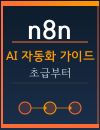

# 들어가며



> "반복되는 일은 기계에게, 창의적인 일은 나에게"

---

## 이 책을 쓰게 된 이유

매일 아침 출근해서 똑같은 엑셀 파일을 복사하고, 같은 내용의 이메일을 보내고, 데이터를 하나씩 옮기는 작업을 반복하고 있지는 않으신가요?

전 세계 직장인의 약 60%가 전체 업무 시간의 30% 이상을 반복적인 작업에 쏟아붓는다는 연구 결과가 있습니다. 이는 주 40시간 기준으로 매주 12시간이 넘는 시간이 단순 반복에 낭비되고 있다는 뜻입니다.

이 책은 그 낭비를 멈추기 위해 쓰였습니다.

---

## n8n이 왜 특별한가요?

시중에는 Zapier, Make(구 Integromat), Power Automate 등 다양한 자동화 도구가 있습니다. 그럼에도 n8n을 선택해야 하는 이유는 분명합니다.

1. 오픈소스 & 무료 자가 호스팅

서버에 직접 설치하면 사용량에 제한이 없고 비용이 거의 들지 않습니다. 수천 개의 워크플로우를 돌려도 추가 요금 없이 가능합니다.

2. 코드도 되고, 노코드도 된다

드래그 앤 드롭으로 연결하는 비주얼 편집기를 제공하면서도, 필요할 때는 JavaScript 코드를 직접 삽입할 수 있습니다. 두 세계의 장점을 모두 취할 수 있습니다.

3. AI와의 완벽한 통합

2026년 현재, n8n은 OpenAI GPT, Anthropic Claude, Google Gemini 등 모든 주요 AI 모델과 네이티브 통합을 지원합니다. AI 에이전트가 스스로 판단하고 행동하는 워크플로우를 만들 수 있습니다.

4. 400개 이상의 앱 연동

Gmail, Slack, Notion, Google Sheets, Airtable, HubSpot, Stripe, AWS 등 거의 모든 서비스와 연결됩니다.

---

## 이 책의 구성 방식

이 책은 "배우고 → 실습하고 → 응용하는" 3단계 구조로 설계되었습니다.

```
개념 설명 → 실제 예시 → 직접 해보기 → 핵심 정리
```

각 챕터는 독립적으로 읽을 수 있도록 구성되어 있습니다. 이미 자동화 개념에 익숙하다면 2장부터 시작해도 좋습니다. n8n을 어느 정도 사용해봤다면 4장이나 5장으로 바로 넘어가도 됩니다.

---

## 학습 전 준비사항

### 필수 준비물
- [ ] 인터넷이 연결된 컴퓨터
- [ ] 웹 브라우저 (Chrome 또는 Edge 권장)
- [ ] n8n Cloud 무료 계정 또는 Docker 환경

### 선택 준비물 (7장 이후 필요)
- [ ] OpenAI API 키 (platform.openai.com)
- [ ] Anthropic API 키 (console.anthropic.com)
- [ ] Google Cloud 계정 (Google Sheets, Gmail 연동 시)

### 사전 지식
- 코딩 지식: 불필요 (기초 JavaScript는 6장 이후 조금 나옵니다)
- 자동화 경험: 없어도 됩니다
- 필요한 것은 오직 해보려는 의지입니다

---

## 이 책을 100% 활용하는 방법

### 1. 직접 따라하기
책을 읽으면서 동시에 n8n을 열어 직접 실습해 보세요. 눈으로 보는 것과 손으로 만드는 것은 완전히 다른 경험입니다.

### 2. 나만의 예시 만들기
각 레슨의 예시를 그대로 따라한 후, 내 업무에 맞게 변형해 보세요. "이메일 자동화"를 배웠다면 내가 자주 보내는 이메일 유형에 적용해 보는 식입니다.

### 3. 에러를 두려워하지 않기
자동화 워크플로우는 처음에 잘 안 되는 게 정상입니다. 에러 메시지는 친절한 안내판입니다. 이 책의 4장에서 디버깅과 에러 처리 방법을 상세히 다룹니다.

### 4. 커뮤니티 활용하기
n8n 공식 커뮤니티(community.n8n.io)에는 전 세계 자동화 전문가들이 활동하고 있습니다. 막히는 부분이 있을 때 질문하고 함께 성장하세요.

---

## 이 책이 추구하는 철학

> "자동화는 게으름이 아니라, 더 중요한 일에 집중하기 위한 선택이다."

단순 반복 업무를 자동화하면 여러분은 다음에 집중할 수 있습니다:
- 창의적인 문제 해결
- 사람과의 진정한 소통
- 전략적 사고와 기획
- 배움과 성장

자동화는 나를 대체하는 것이 아니라, 나를 더 나답게 만드는 도구입니다.

---

## 시작할 준비가 되셨나요?

1장에서 자동화의 세계로 함께 떠나봅시다.

---

*이 책은 2026년 04월 01일을 기준으로 작성되었으며, n8n의 최신 기능을 반영합니다.*

---

## 문의 및 커뮤니티

- 이메일 문의: [leemanrank@gmail.com](mailto:leemanrank@gmail.com)
- 인공지능 정보공유 단톡방 참여: [https://open.kakao.com/o/s4OEqBai](https://open.kakao.com/o/s4OEqBai)
